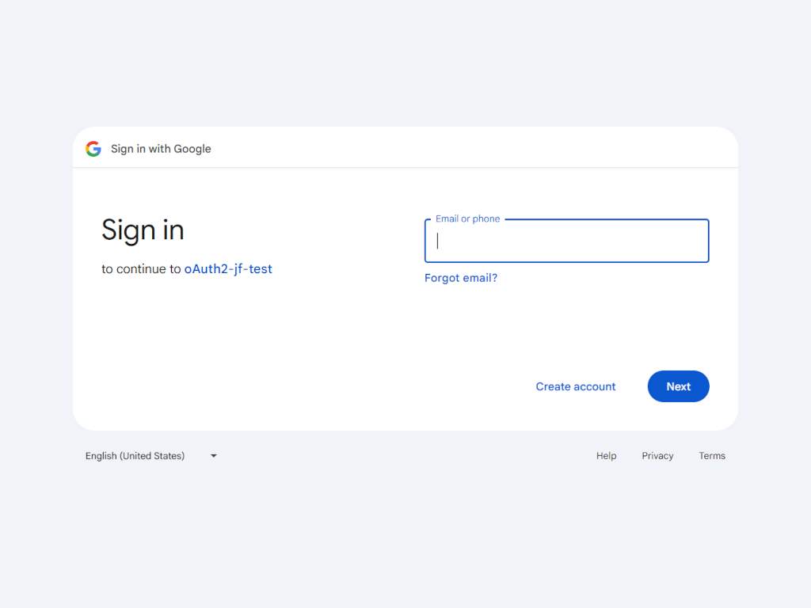

# Angular Login/SignUp page with Google OAuth Login


This project was originally generated with [Angular CLI](https://github.com/angular/angular-cli) version 15.0.4 two years ago. It has since been updated to version ^19.2.14.

## 🔍 Meta Description

A frontend portfolio project built with Angular and Google OAuth login, reusing the login interface from a previous project created with HTML, CSS, JavaScript, and Bootstrap.

## 📸 Screenshots





## 🚀 Features

- ✅ Responsive login & registration form layout
- 🔐 Google OAuth login integration
- 💡 Form validation with meaningful error messages
- 🌐 Mobile-friendly design
- ⚙️ Built with modern web technologies (e.g. Angular, Bootstrap)
- 🎯 Easily extensible for additional authentication providers

## 🔧 Technologies Used

- HTML5
- CSS3
- Bootstrap 5
- TypeScript
- Angular
- Google OAuth
- Lighthouse (Accessibility/Performance audit)

## 📦 Getting Started

### 1. Clone the repository

```bash
git clone https://github.com/GboHalasz/learn_angular_oauth_google_login.git
cd learn_angular_oauth_google_login
```

### 2. Install dependencies

```bash
npm install
```

### 3. Start development server

```bash
ng serve
```

💡 If you want to test Google OAuth functionality, use the production configuration:
```bash
ng serve --configuration production
```

### 4. Code scaffolding

Generate a new component.

```bash
ng generate component component-name
```

### 5. Build for production

```bash
npm run build
```
The build artifacts will be stored in the `dist/` directory.

### 6. Running unit tests

Execute the unit tests via [Karma](https://karma-runner.github.io).
```bash
npm test
```

## Further help

To get more help on the Angular CLI use `ng help`.


## 👩‍💻 Author

Created by **Gabor Halasz**  
GitHub: [@GboHalasz](https://github.com/GboHalasz)
